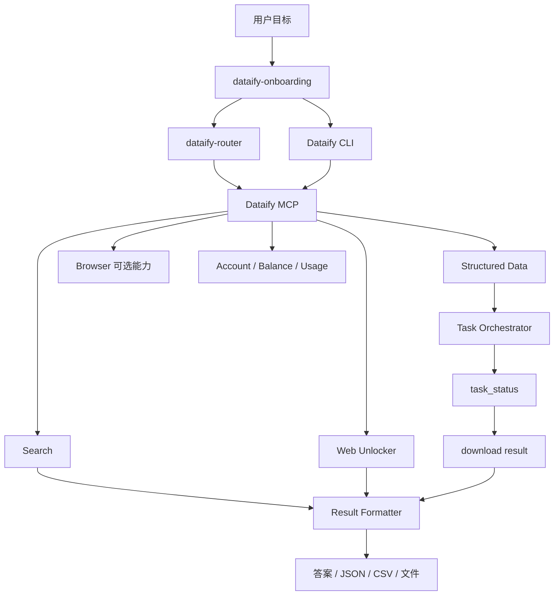
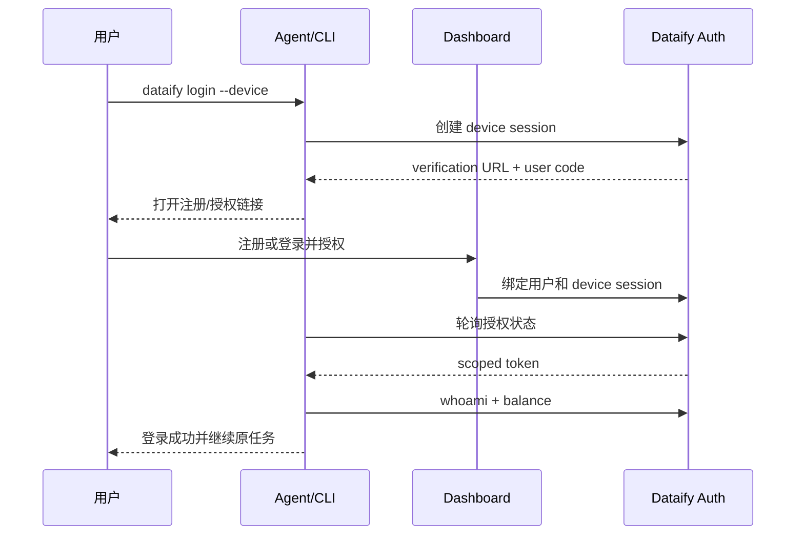

# Dataify Skills 对标 Bright Data 完整优化方案

状态：Draft / 待产品与架构评审  
版本：v1.0  
日期：2026-08-31  
关联方案：[下载到注册转化技术方案](./conversion-technical-plan.md)

## 1. 执行摘要

Dataify 不应继续把“更多独立平台 Skill”作为核心增长策略。目标应从“67 个可下载的 API Skill”升级为“一个能自动完成网络数据任务的 Agent 数据层”。

建议采用类似 Bright Data 的分层逻辑，但保留 Dataify 在结构化采集、中文市场、低门槛和安全确认方面的差异化：

```text
统一 Onboarding
→ MCP / CLI 单一执行层
→ 搜索 / 解锁 / 结构化数据自动路由
→ 注册授权与免费权益说明
→ 异步任务自动等待
→ 最终结果交付
→ 复用与付费转化
```

核心决策：

1. 主推 `dataify-mcp`、`dataify-onboarding` 和 `dataify-router`，不再平均推广所有平台 Skill。
2. 将平台级 Skill 降为长尾获客入口和 MCP 工具契约，不作为主要产品体验。
3. 建设统一 CLI，承载登录、搜索、采集、任务等待、结果下载和余额查询。
4. 把 `task_id` 从用户交付物变成内部状态，实现异步闭环。
5. 用 Device Authorization 替代手工复制主 Token。
6. 优先发布竞品分析、价格监控、评论分析等业务结果型 Skill。

## 2. 竞品事实基线

Bright Data 当前公开能力体现出以下产品结构：

- `agent-onboarding` 负责在 CLI、MCP、SDK、REST 和认证路径之间路由。
- Bright Data MCP 使用基础工具默认加载、专业工具按 group/allowlist 加载。
- CLI 提供 `login`、`search`、`scrape`、`pipelines`、`status --wait`、`budget` 等统一命令。
- 结构化数据任务在 CLI/MCP 内自动轮询，而不是把任务 ID 作为最终结果。
- 免费权益在认证步骤明确表达：每月 5,000 请求、无需信用卡、额度用完硬停止。
- 公开 Skill 从接口型扩展到 `competitive-intel`、`live-research`、`rag-pipeline` 等结果型能力。

来源：

- [Bright Data Skills](https://github.com/brightdata/skills)
- [Bright Data Agent Onboarding](https://github.com/brightdata/skills/blob/main/skills/agent-onboarding/SKILL.md)
- [Bright Data MCP](https://github.com/brightdata/brightdata-mcp)
- [Bright Data CLI Skill](https://github.com/brightdata/skills/blob/main/skills/brightdata-cli/SKILL.md)
- [Bright Data OpenClaw Plugin](https://github.com/brightdata/openclaw-plugin)
- [Bright Data MCP Pricing](https://brightdata.com/pricing/mcp-server)

这些事实不意味着 Dataify 应复制 Bright Data 的宽触发策略、URL Token 或复杂 Pro Mode；这些是应避免的风险。

## 3. 产品定位

### 3.1 新定位

推荐定位：

> Dataify 是面向 AI Agent 的结构化网络数据执行层。用户描述目标，Dataify 自动选择搜索、网页解锁或平台采集能力，并负责认证、任务等待与结果交付。

### 3.2 用户可见承诺

- 一个入口覆盖搜索、网页内容和主流平台结构化数据。
- 用户不需要理解 `spider_id`、Builder 或轮询接口。
- 低风险任务默认直接执行。
- 高成本任务执行前展示范围和预计消耗。
- 异步任务完成后自动交付数据。
- 新用户获得明确、可验证的免费体验。

### 3.3 差异化

Dataify 不与 Bright Data 比“工具数量最多”，而应强化：

- 中文和国际双语 Agent 体验。
- 更简单的统一积分和成本提示。
- 更低的首次使用门槛。
- 对电商、社媒、视频等业务场景的端到端结果交付。
- 明确用户授权和付费任务确认，避免宽触发导致意外消费。

## 4. 目标产品架构



### 4.1 层级职责

| 层级 | 组件 | 职责 |
| --- | --- | --- |
| 发现层 | ClawHub、GitHub、官网 | 场景价值、安装和免费权益 |
| Onboarding | `dataify-onboarding` | 检测环境、认证、选择 MCP/CLI/REST、执行首次验证 |
| 决策层 | `dataify-router` | 根据目标选择最小能力和风险策略 |
| 执行层 | MCP、CLI | 调用接口、认证、重试、轮询、下载和输出 |
| 原子能力 | Search、Unlocker、Scraper | 真实数据服务 |
| 场景层 | 竞品、价格、评论、研究 | 组合原子能力并形成业务结果 |
| 增长层 | Activation、埋点、实验 | 注册恢复、归因和转化优化 |

## 5. Skill 产品线重构

当前仓库有 67 个 Skill。建议采用三级组合，不立即删除已有 Skill。

### 5.1 一级：核心入口 Skill

| Skill | 作用 |
| --- | --- |
| `dataify-onboarding` | 安装、注册、授权、验证和路径路由 |
| `dataify-router` | 用户目标到工具的自动选择 |
| `dataify-mcp` | MCP 工具选择、工具组、错误与工作流 |
| `dataify-cli` | 统一终端命令和认证 |

### 5.2 二级：通用能力 Skill

| Skill | 作用 |
| --- | --- |
| `dataify-search` | Google/Bing/Yandex/DDG 和垂直搜索 |
| `dataify-scrape` | 已知 URL 的网页解锁和正文提取 |
| `dataify-structured-data` | 所有平台结构化采集的统一入口 |
| `dataify-task-operations` | 状态规范化、等待、结果和失败处理 |
| `dataify-account` | 余额、积分价格、用量和 Token 状态 |
| `dataify-best-practices` | SDK/API 编码、错误、批处理和安全规范 |

### 5.3 三级：业务结果型 Skill

首批建议：

- `dataify-competitive-intel`
- `dataify-price-monitoring`
- `dataify-review-analysis`
- `dataify-live-research`
- `dataify-lead-research`
- `dataify-seo-research`

### 5.4 现有平台 Skill 的处理

现有平台 Skill：

- 保留 ClawHub slug 和兼容版本。
- metadata 改为用户结果表达。
- 在正文开头优先调用 `dataify-structured-data` 或 MCP 工具。
- 详细参数移入 references/schema，不重复维护认证、轮询和输出逻辑。
- ClawHub 页面作为长尾搜索入口，统一导向 MCP Plugin。
- 不再为每个平台复制 Token、PowerShell 和 Builder 教程。

## 6. 统一路由逻辑

### 6.1 工具优先级

```text
用户需要查找信息
→ Search

用户已提供 URL，需要正文
→ Web Unlocker

目标属于已支持平台，需要字段化数据
→ Structured Data 专用工具

需要点击、输入、登录或滚动
→ Browser 能力（后续提供）

需要多源分析
→ 场景 Skill 编排多个工具
```

### 6.2 路由规则

- 专用结构化工具优先于 HTML 抓取。
- 同步能力优先于异步能力，前提是能满足用户结果。
- 已知目标参数时不重复询问。
- 仅缺少必填项时追问。
- 批量、媒体下载、付费异步任务必须展示成本驱动参数。
- 禁止在用户未明确选择 Dataify 时替换所有宿主内置 Web 工具。

### 6.3 工具组

默认基础组：

```text
account_info
balance
search
scrape
task_status
task_result
```

按需组：

```text
ecommerce
social
video
business
jobs
travel
maps
developer
```

MCP 应支持 `groups` 或 `tools` 白名单，并支持 Agent 在确认后请求启用额外工具组。

## 7. 统一 CLI 方案

建议发布 `dataify` CLI：

```bash
dataify login
dataify login --device
dataify logout
dataify whoami

dataify search "AI news"
dataify scrape https://example.com
dataify collect amazon-product https://amazon.com/dp/...

dataify task <task-id>
dataify task <task-id> --wait
dataify task <task-id> --result

dataify balance
dataify usage
dataify tools list
dataify tools enable ecommerce
dataify skills add
```

### 7.1 CLI 责任

- OAuth/Device Authorization。
- scoped token 安全保存。
- MCP 配置生成和客户端检测。
- 参数规范化和输入校验。
- Builder 调用和幂等键。
- `/task_status` 轮询。
- `/download` 结果获取。
- JSON、CSV、Markdown 和文件输出。
- 余额与积分价格查询。
- 脱敏日志和诊断信息。

### 7.2 输出原则

- TTY 默认人类可读格式。
- `--json` 输出紧凑 JSON。
- `--pretty` 输出格式化 JSON。
- `--output file.csv` 写入文件。
- 管道模式关闭颜色和 spinner。
- stdout 仅输出结果，诊断信息写 stderr。

## 8. 认证与注册优化

### 8.1 推荐流程



### 8.2 免费权益文案

在业务确认后统一远程配置：

```text
新账号注册即得 50 免费积分，约可采集 6000 条结果，
7 天有效，仅成功请求计费。完成授权后自动继续当前任务。
```

不得在未确认政策时承诺“无需信用卡”“额度用完硬停止”或适用于所有产品。

### 8.3 安全

- 不在 MCP URL、CLI 参数或 Prompt 中暴露主 Token。
- 使用 scoped token，最小权限和可撤销。
- 本地优先存系统 Keychain；环境变量仅作为兼容路径。
- 注册会话保存待恢复目标，但不保存敏感页面内容。
- 日志、埋点、错误和 dry-run 强制脱敏。

## 9. 异步任务闭环

当前仓库已经出现：

- `dataify-task-status`：调用 `/task_status`。
- `dataify-task-result`：调用 `/download`。

应将其整合进统一 Task Orchestrator：

```text
submit
→ task_id
→ poll /task_status
→ 处理中：继续等待
→ 成功：GET /download?type=json
→ 失败：返回失败原因和安全重试建议
```

### 9.1 状态模型

```text
submitted → queued → running → succeeded
                            ├→ failed
                            └→ cancelled
```

保留原始 `provider_status`，只有已验证状态才映射到统一状态。

### 9.2 轮询

- 0–2 分钟：5 秒。
- 2–10 分钟：15 秒。
- 10 分钟后：30 秒。
- 尊重 `Retry-After`。
- 默认超时 15 分钟，可交给后台通知。
- 查询失败不得重新提交付费任务。
- 提交接口使用 idempotency key 防重复计费。

### 9.3 用户输出

默认结果：

```text
任务已完成
共获取 N 条记录
关键结果摘要
原始 JSON / CSV 下载入口
积分消耗
```

用户不应被要求复制 `task_id` 到 Dashboard。

## 10. 业务结果型 Skill 示例

### 10.1 竞品情报

输入：

```text
分析 Nike 和 Adidas 最近的价格、评论和内容策略
```

流程：

1. Search 发现官方页面和近期新闻。
2. Structured Data 获取 Amazon/Walmart 商品。
3. 获取 Reddit、YouTube 等评论内容。
4. 自动等待所有异步任务。
5. 去重、字段标准化和情绪分析。
6. 输出价格矩阵、用户痛点、内容策略和来源。

### 10.2 价格监控

1. 用户提交 SKU/URL 列表。
2. 预估平台、记录数、频率和积分。
3. 用户确认后创建任务。
4. 定时采集并计算变动。
5. 异常价格触发通知。

### 10.3 评论分析

1. 获取商品/视频/帖子评论。
2. 自动翻页和等待结果。
3. 聚类主题、情绪、痛点和功能诉求。
4. 引用原始评论并给出产品建议。

## 11. ClawHub 与分发优化

### 11.1 主推页面

优先投入：

1. Dataify MCP Plugin。
2. `dataify-onboarding`。
3. `dataify-router`。
4. 3–5 个业务结果型 Skill。

### 11.2 页面模板

每个页面必须包含：

- 一句用户结果。
- 一个 30 秒演示。
- 一条安装命令。
- 一个可复制 Prompt。
- 示例结果截图或 JSON。
- 免费权益和计费边界。
- 数据来源、权限和安全说明。
- GitHub、文档和支持入口。

### 11.3 归因链接

```text
utm_source=clawhub
utm_medium=skill
utm_campaign=<skill-slug>
utm_content=<skill-page|token-missing|task-result>
skill_version=<version>
```

注册完成后必须恢复原任务。

## 12. 数据漏斗与实验

### 12.1 事件

```text
skill_installed
skill_invoked
token_missing
registration_clicked
registration_completed
agent_authorized
first_api_call_started
first_api_call_succeeded
task_submitted
task_succeeded
result_delivered
second_api_call_7d
```

### 12.2 指标

| 指标 | 目标 |
| --- | ---: |
| 下载→安装 | 观察指标，目标 ≥5% |
| 安装→首次调用 | ≥40% |
| Token 缺失→注册 | ≥20% |
| 注册→首次成功 | ≥60% |
| 成功调用→结果交付 | ≥95% |
| 首次价值时间 P50 | <2 分钟 |
| 7 日再次调用 | ≥20% |

### 12.3 首批实验

1. “50 免费积分”对比“约 6000 条结果”。
2. 静态样例对比一次匿名真实查询。
3. 完整参数确认对比低风险直接执行。
4. 平台原子 Skill 对比业务结果型 Skill。
5. 手动 Token 对比 Device Authorization。

## 13. 工程质量与治理

### 13.1 单一事实源

- 平台工具参数由 schema 生成 Skill references、MCP tool schema 和 CLI help。
- 中英文文档由同一结构化源生成。
- 认证、确认、错误和结果策略只维护一份。
- Skill 不复制公共实现代码。

### 13.2 CI 门禁

- frontmatter 和本地引用校验。
- MCP/CLI/Skill schema 一致性。
- Token 泄漏扫描。
- 示例命令 dry-run。
- mocked API 契约测试。
- 中英文一致性测试。
- ClawHub 包内容清单和版本校验。

### 13.3 版本策略

- 核心 Skill 和 MCP 使用同一兼容矩阵。
- 非破坏性文案和字段新增走 minor。
- 工具名、认证或输出结构变化走 major。
- 支持至少一个旧 minor 版本的迁移提示。

## 14. 实施路线图

### Phase 0：确认与基线，1 周

- 验证 `/task_status`、`/download` 和 MCP 任务工具契约。
- 确认免费权益和扣费边界。
- 建立注册、首次调用和结果交付事件。
- 获取当前 30 天漏斗基线。

交付物：接口契约、指标看板、业务规则签字。

### Phase 1：任务闭环，1–2 周

- 合并 task status/result 到 Task Orchestrator。
- 为 Amazon Product、Google Maps、YouTube 做 E2E。
- 返回最终结果而不是 Dashboard 跳转。

交付物：三条端到端任务链路，成功交付率 ≥95%。

### Phase 2：Onboarding 与 CLI，2–3 周

- 实现 `dataify login --device`。
- 支持 `whoami`、`balance`、`search`、`scrape`、`collect`、`task --wait`。
- 自动生成 MCP 配置。
- 注册后恢复原任务。

交付物：新用户两分钟内完成首次结果。

### Phase 3：Skill 收敛，2 周

- 新增 onboarding、MCP、CLI、search、scrape、structured-data。
- 平台 Skill 改为兼容代理层。
- 公共规则迁入单一 reference/schema。
- ClawHub 主页面重写。

交付物：核心入口 8–12 个，现有 slug 保持兼容。

### Phase 4：场景增长，2–4 周

- 上线竞品分析、价格监控、评论分析。
- 执行 A/B 实验。
- 优化注册和 7 日留存。

交付物：至少三个能交付完整业务结果的 Skill。

## 15. 优先级与投入估算

| 项目 | 影响 | 工作量 | 优先级 |
| --- | --- | --- | --- |
| 任务状态/结果闭环 | 极高 | 中 | P0 |
| 漏斗埋点与归因 | 极高 | 中 | P0 |
| Device Authorization | 极高 | 高 | P0 |
| 统一 CLI | 高 | 高 | P1 |
| 核心 Skill 收敛 | 高 | 中 | P1 |
| 免费权益 CTA | 高 | 低 | P1 |
| 结果型 Skill | 高 | 中 | P1 |
| 工具组按需加载 | 中 | 中 | P2 |
| Browser 工具 | 中 | 高 | P2 |
| SDK 全面建设 | 中 | 高 | P3 |

建议最小团队：后端 1–2、人机/插件 1、前端 1、数据分析 0.5、产品 1。实际排期依赖现有认证和任务接口成熟度。

## 16. 风险与护栏

| 风险 | 护栏 |
| --- | --- |
| Skill 自动调用造成意外费用 | 成本驱动参数确认、预算阈值、幂等键 |
| Token 泄漏 | Device Flow、scoped token、Keychain、日志脱敏 |
| 轮询放大后端压力 | 分段轮询、Retry-After、后台通知 |
| 平台 Skill 收敛损失长尾流量 | 保留 slug 和兼容层，不立即删除 |
| 免费试用被滥用 | 设备/IP/账户限流、预算熔断、风控 |
| MCP 工具过多影响 Agent 选择 | 基础工具 + groups/allowlist |
| 业务结果型 Skill 输出不可信 | 原始来源、字段证据、失败透明化 |
| 模仿竞品失去差异化 | 保留更明确的用户确认、中文体验和简单计费 |

## 17. 非目标

- 不以工具数量超过 Bright Data 作为成功标准。
- 不在第一阶段删除 67 个现有 Skill。
- 不默认替换宿主所有 WebSearch/WebFetch。
- 不自动重试可能重复扣费的采集任务。
- 不在未确认业务规则前承诺永久免费或绝不扣费。
- 不同时重构所有底层数据采集服务。

## 18. 开放问题

实施前必须确认：

1. `/task_status` 和 `/download` 的正式 SLA、状态、鉴权和限流。
2. `dataify-task-status` 成功时自动下载与独立 `dataify-task-result` 的职责是否重复。
3. 是否可以签发 Agent scoped token 和支持 Device Authorization。
4. 免费 50 积分的适用产品、地区、有效期和用尽行为。
5. MCP 是否支持动态工具组和远程工具启用。
6. 是否已有统一账户余额、积分价格和用量接口。
7. 异步结果完成后的通知能力由谁承载。
8. ClawHub page view 和 referrer 是否可获得。
9. CLI 的包名、发布渠道和密钥存储方案。
10. 业务结果型 Skill 的 LLM 分析成本由谁承担。

## 19. 验收与决策门

### Go 条件

- 后端确认任务接口可稳定查询和下载结果。
- 注册系统能提供安全的 Agent 授权方案。
- 业务确认免费权益和成本护栏。
- 转化事件能够关联匿名安装和注册用户。

### No-Go / 延后条件

- 任务结果只能人工从 Dashboard 获取。
- 无法避免主 Token 进入 URL、日志或 Prompt。
- 无法区分首次免费调用和付费任务。
- 没有漏斗数据却计划一次性重构全部 Skill。

### 推荐下一步

先完成 Phase 0 接口和数据基线评审，再建设 Task Orchestrator。不要先批量改写 67 个 Skill；任务结果闭环和认证闭环才是转化的基础。
