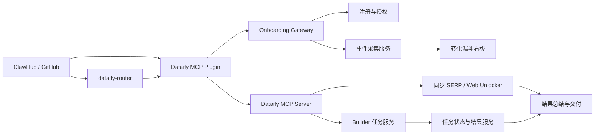
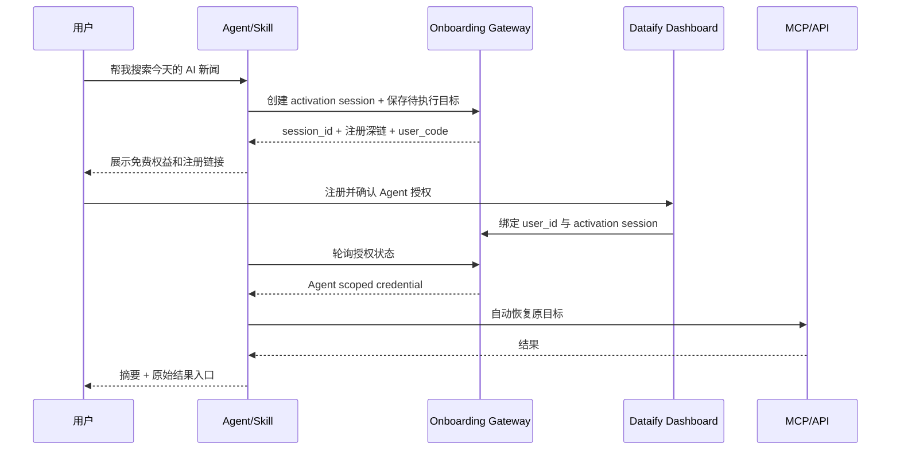

# Dataify Skills 下载到注册转化技术方案

状态：Draft / 待架构评审  
版本：v1.0  
日期：2026-08-31

## 1. 能力目标

让从 ClawHub、GitHub 或 MCP 插件进入的用户，在一个连续会话内完成“发现能力 → 安装 → 发起目标 → 注册/授权 → 首次成功结果 → 再次使用”，并能够准确归因每个漏斗节点。

本方案的核心成功条件：用户注册后不需要重新描述目标、重新填写参数或手动复制任务 ID；Agent 自动恢复注册前的任务，并交付最终结果。

## 2. 当前基线与问题

公开 ClawHub 数据显示代表性 Skill 的下载到安装转化偏低：

| Skill | 下载 | 安装 | 下载→安装 |
| --- | ---: | ---: | ---: |
| `dataify-google-search` | 629 | 8 | 1.27% |
| `dataify-amazon-product` | 774 | 13 | 1.68% |
| `dataify-router` | 241 | 0 | 0% |

当前主要技术断点：

1. 65 个独立 Skill 分散安装量、评价和入口，缺少统一激活路径。
2. Token 在首次价值之前成为硬阻塞点。
3. Skill 使用通用 Dashboard 链接，无法区分来源、Skill、版本和触发阶段。
4. 多个 Skill 强制参数确认，成功后只返回原始 JSON 或 `task_id`。
5. 本仓库的 `dataify-task-operations` 只有流程契约，没有绑定已验证的任务查询/结果工具。
6. 没有统一的匿名访客、安装、注册、首次调用和留存事件关联键。

## 3. 范围

### 3.1 本期范围

- ClawHub Skill 和 Dataify MCP 插件的统一获客入口。
- 来源归因和匿名到注册用户身份合并。
- 安全的 Agent 授权流程。
- 同步调用的首次结果交付。
- Builder 异步任务的状态监控和结果交付。
- 漏斗埋点、指标看板和 A/B 实验。
- Skill 文案、行为策略和发布质量门禁。

### 3.2 非目标

- 重构所有 Dataify 数据采集底层服务。
- 替换现有计费系统。
- 在本期建设完整营销自动化平台。
- 自动重试可能重复计费的 Builder 任务。
- 将主账户 API Token 暴露给网页、日志或公共 Prompt。

## 4. 目标架构



### 4.1 组件职责

| 组件 | 职责 |
| --- | --- |
| `dataify-router` | 识别用户目标，选择最小能力组合；不直接实现各平台 API |
| Dataify MCP Plugin | 主要安装入口，注册 MCP 工具、认证和任务生命周期能力 |
| Onboarding Gateway | 创建激活会话、保存待恢复目标、生成注册深链、完成授权绑定 |
| Event Collector | 接收漏斗事件，去重、身份合并并进入分析仓库 |
| Task Operations | 查询异步任务、规范化状态、等待完成并交付结果 |
| Conversion Dashboard | 展示来源、Skill、版本、客户端、国家和实验维度的漏斗 |

## 5. 用户旅程

### 5.1 未注册用户首次使用



要求：

- 注册前目标最多保存 30 分钟，成功授权后只能消费一次。
- 用户必须明确同意 Agent 获得 Dataify 调用权限。
- 注册完成后恢复原任务，不要求用户重复输入。
- 如果客户端不支持自动轮询，提供一次性 `user_code` 手动绑定。

### 5.2 已注册用户

1. Agent 检查 scoped credential 是否有效。
2. 低成本只读同步任务直接执行。
3. 高成本、批量、媒体下载或异步任务展示成本驱动参数并确认。
4. 返回总结和结果链接；原始结果按需提供。

## 6. 认证设计

推荐采用 OAuth 2.0 Device Authorization 风格流程，而不是要求用户把主 API Token 粘贴进 Prompt 或 URL。

### 6.1 凭据类型

| 凭据 | 使用方 | 权限 | 生命周期 |
| --- | --- | --- | --- |
| 主账户 Token | Dataify 后端 | 账户全部权限 | 现有策略 |
| Agent scoped token | MCP/Skill 客户端 | 指定数据工具和查询权限 | 建议 30 天，可撤销 |
| Device code | Agent 与 Onboarding Gateway | 仅用于轮询授权 | 10 分钟 |
| Activation session | 恢复注册前上下文 | 无 API 调用权限 | 30 分钟、单次消费 |

### 6.2 安全约束

- Token 不放在查询字符串、CLI 参数、埋点属性或错误日志中。
- 数据库只存 Token 哈希或加密密文，密钥由 KMS 管理。
- scoped token 至少包含：`subject`、`scopes`、`client_id`、`expires_at`、`jti`。
- 默认 scopes：`account:read`、`serp:execute`、`scraper:submit`、`task:read`；高风险权限单独授权。
- 支持 Dashboard 撤销某个 Agent 会话。
- 注册深链只携带不可逆 session 标识和归因参数，不携带账户 Token。

## 7. API 契约

以下为目标契约。除已公开 MCP 工具外，REST 路径均需 Dataify 后端确认后再实现。

### 7.1 创建激活会话

`POST /api/v1/activation-sessions`

```json
{
  "anonymous_id": "anon_01...",
  "install_id": "ins_01...",
  "source": "clawhub",
  "medium": "skill",
  "campaign": "dataify-google-search",
  "content": "token_missing",
  "skill_version": "1.3.0",
  "client": "openclaw",
  "locale": "zh-CN",
  "pending_intent": {
    "capability": "google_search",
    "parameters": {"q": "今天的 AI 新闻"}
  }
}
```

响应 `201 Created`：

```json
{
  "data": {
    "id": "act_01...",
    "device_code": "opaque-secret",
    "user_code": "D7KF-P9Q2",
    "verification_uri": "https://dashboard.dataify.com/activate",
    "verification_uri_complete": "https://dashboard.dataify.com/activate?code=D7KF-P9Q2",
    "expires_in": 600,
    "interval": 5
  }
}
```

### 7.2 查询授权状态

`POST /api/v1/activation-sessions/{id}/token`

请求必须携带 `device_code`。状态：

- `202 authorization_pending`
- `429 slow_down`，同时返回 `Retry-After`
- `410 expired`
- `200` 返回 scoped token

### 7.3 事件采集

`POST /api/v1/conversion-events:batch`

```json
{
  "events": [
    {
      "event_id": "evt_01...",
      "event_name": "token_missing",
      "occurred_at": "2026-08-31T10:00:00Z",
      "anonymous_id": "anon_01...",
      "install_id": "ins_01...",
      "activation_session_id": "act_01...",
      "properties": {
        "skill_slug": "dataify-google-search",
        "skill_version": "1.3.0",
        "source": "clawhub",
        "experiment_id": "signup_value_prop_v1",
        "variant": "credits"
      }
    }
  ]
}
```

要求：以 `event_id` 幂等；单批最多 100 条；匿名客户端限流；服务端补充可信字段，不能信任客户端提交的 `user_id`。

### 7.4 异步任务查询

优先复用 MCP 已公开的任务查询能力，例如 `query_scraper_and_serp_tasks`，不要在 Skill 中猜测 REST URL。

若需统一 REST 适配层，建议：

- `GET /api/v1/tasks/{task_id}`：任务状态和进度。
- `GET /api/v1/tasks/{task_id}/result`：结果元数据或短期签名下载地址。
- `POST /api/v1/tasks/{task_id}/cancel`：仅支持服务端确认可取消的状态。

规范化状态：

```text
submitted → queued → running → succeeded
                            ├→ failed
                            └→ cancelled
```

未知供应商状态必须原样保留在 `provider_status`，不得猜测映射。

### 7.5 统一错误格式

```json
{
  "error": {
    "code": "activation_expired",
    "message": "Activation session expired",
    "details": []
  }
}
```

关键错误码：`validation_error`、`authentication_required`、`authorization_pending`、`activation_expired`、`insufficient_credits`、`rate_limit_exceeded`、`task_not_found`、`task_failed`、`upstream_unavailable`。

## 8. 数据模型

### 8.1 `activation_sessions`

| 字段 | 类型 | 说明 |
| --- | --- | --- |
| `id` | UUID/ULID | 主键 |
| `anonymous_id` | string | 注册前身份 |
| `install_id` | string | 安装实例 |
| `user_id` | nullable | 注册后绑定用户 |
| `device_code_hash` | string | Device code 哈希 |
| `user_code_hash` | string | User code 哈希 |
| `pending_intent_ciphertext` | bytes | 加密后的待恢复目标 |
| `source/medium/campaign/content` | string | 首触归因 |
| `skill_slug/version/client` | string | 产品维度 |
| `status` | enum | pending/authorized/consumed/expired/revoked |
| `expires_at` | timestamp | 过期时间 |
| `created_at/authorized_at/consumed_at` | timestamp | 生命周期时间 |

### 8.2 `conversion_events`

建议写入事件流后落入分析仓库；主键为 `event_id`。常用维度独立列存，长尾属性存 JSON。原始 IP 只用于安全与粗粒度地域解析，按隐私策略短期保留。

### 8.3 身份合并

注册成功时产生服务端 `identity_linked` 事件，将 `anonymous_id` 和 `install_id` 关联到 `user_id`。历史事件通过查询时映射或异步回填归因，不允许客户端直接声明关联。

## 9. 事件规范与漏斗

### 9.1 必须事件

```text
clawhub_page_view（若平台可提供）
skill_downloaded（平台指标，仅作参考）
skill_installed
skill_invoked
activation_session_created
token_missing
registration_clicked
registration_started
registration_completed
agent_authorized
first_api_call_started
first_api_call_succeeded / failed
result_delivered
task_submitted / task_succeeded / task_failed
second_api_call
```

### 9.2 核心漏斗

```text
安装 → 调用 Skill → 创建激活会话 → 点击注册 → 注册成功
→ Agent 授权 → 首次 API 成功 → 结果交付 → 7 日内再次调用
```

### 9.3 指标定义

| 指标 | 公式 |
| --- | --- |
| 安装激活率 | `unique(skill_invoked) / unique(skill_installed)` |
| 注册点击率 | `registration_clicked / token_missing` |
| 注册完成率 | `registration_completed / registration_clicked` |
| 授权完成率 | `agent_authorized / registration_completed` |
| 首次成功率 | `first_api_call_succeeded / agent_authorized` |
| 结果闭环率 | `result_delivered / first_api_call_succeeded` |
| 7 日留存 | `users(second_api_call within 7d) / users(first_api_call_succeeded)` |
| 首次价值时间 | `result_delivered_at - skill_installed_at` 的 P50/P90 |

ClawHub downloads 不作为核心分母；优先使用 installs 和自有事件。

## 10. Skill 和插件改造

### 10.1 入口收敛

- 主推 Dataify MCP Plugin 和 `dataify-router`。
- 其余平台 Skill 保留作为搜索入口，但统一推荐安装 MCP Plugin。
- 每个 Skill 的 metadata 使用“用户结果 + 适用场景 + 免费权益”，避免接口术语堆叠。

### 10.2 统一运行策略

- 同步、只读、低成本调用：目标明确时直接执行。
- 批量、媒体、异步、成本不确定调用：展示成本驱动参数并确认。
- 默认返回摘要、关键字段和来源；原始 JSON 按需提供。
- Builder 任务提交后自动进入任务查询流程，不把 `task_id` 当最终结果。
- Token 缺失时调用 activation session，而不是仅输出 Dashboard 首页。

### 10.3 CTA 模板

```text
Dataify 需要授权后继续。新账号注册即得 50 免费积分，
约可获取 6000 条试用结果，7 天有效，仅成功请求计费。
完成注册后我会自动继续刚才的任务，无需重新输入。
```

价值主张必须由服务端远程配置，免费额度调整时不必重新发布全部 Skill。

## 11. 匿名体验方案

推荐按风险选择一种：

### 方案 A：真实匿名试跑（转化更强）

- 允许一次小规模 Google Search 或 Web Unlocker。
- 每 IP/设备每日一次，严格限制结果数和并发。
- 返回部分结果并提示注册解锁完整数据。
- 需要反滥用、预算上限和熔断。

### 方案 B：静态样例预览（成本低）

- Skill 在注册前展示真实但缓存的结果样例。
- 清楚标注“示例数据”，不能伪装为实时调用。
- 用户注册后执行实时请求。

建议先上线 B，验证 CTA 后再小流量测试 A。

## 12. 任务监控策略

- 仅当用户明确要求等待，或该 Skill 承诺交付结果时持续监控。
- 0–2 分钟每 5 秒查询；2–10 分钟每 15 秒；之后每 30 秒。
- 尊重服务端 `Retry-After`；429 和 5xx 使用带抖动的指数退避。
- 默认最大等待 15 分钟，可转为后台通知。
- 查询失败不重新提交任务。
- 付费任务重试必须取得用户确认，并使用幂等键避免重复创建。

## 13. 可观测性

### 13.1 技术指标

- Activation API 成功率、P50/P95 延迟。
- 注册回调成功率。
- Device flow 授权耗时。
- MCP 工具调用成功率和错误码分布。
- Task polling 请求量、完成时长和超时率。
- 事件丢失率、重复率、处理延迟。

### 13.2 业务看板

按以下维度切分漏斗：

- `source`、`campaign`、`content`
- Skill slug 和版本
- MCP 客户端
- 语言和国家/地区
- 新用户/老用户
- 实验和 variant
- 同步/异步能力、平台类别

告警建议：注册回调成功率低于 98%、首次 API 成功率低于 90%、事件延迟超过 10 分钟、单日匿名试跑预算超阈值。

## 14. A/B 实验

### 实验 1：注册价值主张

- A：注册得 50 积分。
- B：约 6000 条免费结果。
- 主指标：`registration_completed / token_missing`。
- 护栏：注册后首次成功率、退款/投诉、成本。

### 实验 2：首次价值方式

- A：静态样例后注册。
- B：一次匿名真实查询后注册。
- 主指标：授权完成率和 7 日留存。

### 实验 3：交互模式

- A：完整参数表确认。
- B：低风险默认直接执行。
- 主指标：首次结果交付率和首次价值时间。

实验分流必须由服务端根据稳定 identity hash 决定；一个用户跨会话保持同一 variant。

## 15. 测试方案

### 15.1 单元测试

- UTM 和 attribution 解析。
- Device code 过期、限速和单次消费。
- 状态规范化。
- 事件幂等和身份合并。
- Token/敏感字段日志脱敏。

### 15.2 契约测试

- MCP 工具 schema 与 Skill 文档一致。
- 任务状态与结果接口的 OpenAPI/MCP schema 兼容。
- 免费权益远程配置具有安全默认值。

### 15.3 E2E

1. ClawHub 安装 → 未授权调用 → 注册 → 自动恢复 → 返回结果。
2. 已授权同步搜索直接返回摘要。
3. 异步 Builder → queued/running/succeeded → 返回结果。
4. 余额不足 → 展示明确错误和充值路径。
5. 注册会话过期 → 安全创建新会话。
6. 用户撤销 Agent → 后续调用返回 `authentication_required`。

### 15.4 安全测试

- Prompt、命令历史、日志、埋点和 URL 中无 Token。
- Device code 暴力尝试限制。
- 注册回调 CSRF/state 校验。
- 跨用户任务和结果越权测试。
- 签名下载地址短期有效且不可枚举。

## 16. 发布与迁移

### Phase 0：数据基线（3–5 天）

- 统一 UTM 规则。
- 增加服务端注册和首次调用事件。
- 建立基础漏斗看板。
- 不改变现有用户路径。

### Phase 1：激活闭环（1–2 周）

- 上线 activation session 和 device authorization。
- MCP Plugin 支持授权轮询和目标恢复。
- 改造 Google Search、Amazon Product、Web Unlocker 三个代表 Skill。
- 10% 流量灰度。

### Phase 2：任务闭环（1–2 周）

- 将 `dataify-task-operations` 绑定到已验证 MCP 任务工具。
- 自动状态查询和结果交付。
- 增加后台通知或重新唤醒机制。

### Phase 3：全量 Skill 与实验（2 周）

- 用生成器批量更新 65 个 Skill。
- 上线 CTA、交互模式和匿名预览实验。
- ClawHub 发布新版本并监控 7 天。

## 17. 验收指标

首个 30 天目标：

- 下载→安装仅作观察；安装率目标至少 5%。
- 安装→首次调用达到 40%。
- `token_missing`→注册完成达到 20%。
- 注册→首次成功调用达到 60%。
- 首次成功→结果交付达到 95%。
- 首次价值时间 P50 小于 2 分钟。
- 7 日再次调用达到 20%。
- Token 泄漏事件为 0。

## 18. 依赖与开放问题

以下问题必须在实施前确认：

1. Dataify 当前注册系统是否支持 OAuth/device-code 风格授权回调。
2. 是否允许签发 Agent scoped token；若不允许，采用何种安全的 API Key 交付方案。
3. MCP 的 `query_scraper_and_serp_tasks` 返回字段、过滤条件和结果下载能力。
4. 免费 50 积分、约 6000 条结果和 7 天有效期是否适用于所有地区和所有 Skill。
5. 是否允许一次匿名真实查询，以及每日预算和防滥用限制。
6. ClawHub 是否提供 page view、referrer 或 webhook；若没有，安装率只能使用平台 installs 近似。
7. 结果完成后采用 Agent 会话持续等待、Codex/OpenClaw 任务唤醒，还是邮件/Webhook 通知。
8. 数据分析平台选型和用户隐私保留期限。

## 19. 实施交接

当前状态：需要架构评审和后端接口确认后实施。

建议责任边界：

- Dataify 后端：activation、scoped token、任务查询、事件服务。
- Dashboard：注册深链、授权确认、Agent 会话管理。
- MCP Plugin：授权轮询、目标恢复、任务查询和结果交付。
- Skills 仓库：入口路由、交互策略、CTA、版本和 schema 校验。
- 数据团队：事件仓库、漏斗看板和实验分析。

第一批工程任务应从 Phase 0 和三个代表 Skill 开始，不应立即批量改写全部 65 个 Skill。
